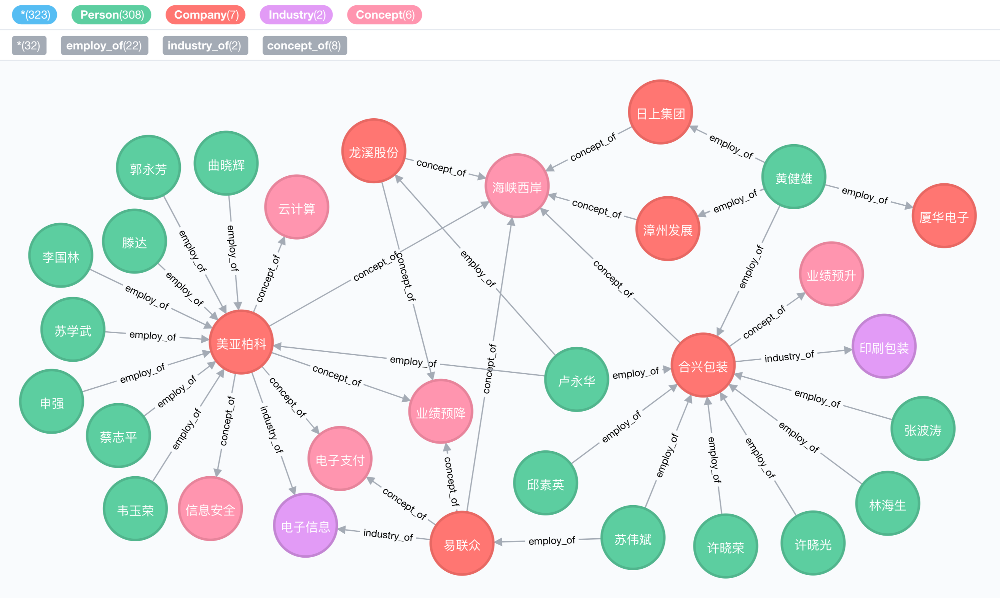
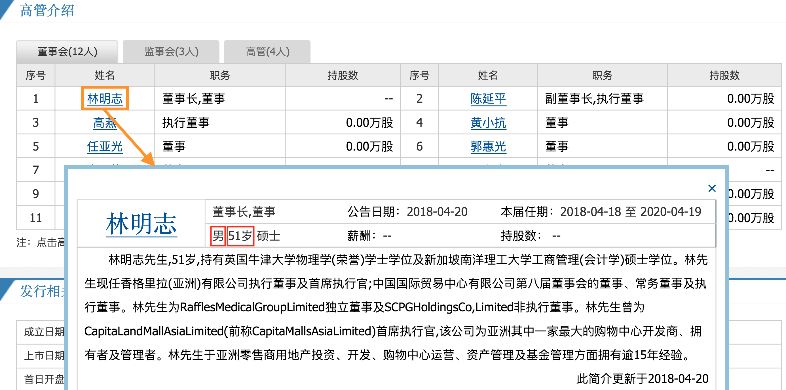

## This project is fork from one open resource to do the improment

# stock-knowledge-graph

A small knowledge graph (knowledge base) construction using data published on the web.

利用网络上公开的数据构建一个小型的证券知识图谱（知识库）。

Welcome to watch, star or fork.



## 工程目录结构

```
stock-knowledge-graph/
├── __init__.py
├── extract.py  # extract html pages for executives information
├── stock.py  # get stock industry and concept information
├── build_csv.py  # build csv files that can import neo4j
├── import.sh
├── data
│   ├── stockpage.zip
│   ├── executive_prep.csv
│   ├── stock_industry_prep.csv
│   ├── stock_concept_prep.csv
│   └── import  # import directory
│       ├── concept.csv
│       ├── executive.csv
│       ├── executive_stock.csv
│       ├── industry.csv
│       ├── stock.csv
│       ├── stock_concept.csv
│       └── stock_industry.csv
├── design.png
├── result.txt
├── img
│   ├── executive.png
│   └── executive_detail.png
├── import.report
├── README.md
└── requirements.txt
```

## 数据源

本项目需要用到两种数据源：一种是公司董事信息，另一种是股票的行业以及概念信息。 

- **公司董事信息**

  这部分数据包含在`data`目录下的`stockpage`压缩文件中，⾥面的每一个文件是以`XXXXXX.html`命名，其中`XXXXXX`是股票代码。这部分数据是由[同花顺个股](http://stockpage.10jqka.com.cn/)的⽹页爬取而来的，执行解压缩命令`unzip stockpage.zip`即可获取。比如对于`600007.html`，这部分内容来自于http://stockpage.10jqka.com.cn/600007/company/#manager

- **股票行业以及概念信息**

  这部分信息也可以通过⽹上公开的信息得到。在这里，我们使用[Tushare](http://tushare.org/)工具来获得，详细细节见之后具体的任务部分。

## 任务1：从⽹页中抽取董事会的信息

在我们给定的html文件中，需要对每一个股票/公司抽取董事会成员的信息，这部分信息包括董事会成员“姓名”、“职务”、“性别”、“年龄”共四个字段。首先，姓名和职务的字段来自于：


在这里总共有12位董事成员的信息，都需要抽取出来。另外，性别和年龄字段也可以从下附图里抽取出来：



最后，生成一个 `executive_prep.csv`文件，格式如下：

| 高管姓名 | 性别 | 年龄 | 股票代码 |    职位     |
| :------: | :--: | :--: | :------: | :---------: |
|  朴明志  |  男  |  51  |  600007  | 董事⻓/董事 |
|   高燕   |  女  |  60  |  600007  |  执⾏董事   |
|  刘永政  |  男  |  50  |  600008  | 董事⻓/董事 |
|   ···    | ···  | ···  |   ···    |     ···     |

注：建议表头最好用相应的英文表示。

## 任务2：获取股票行业和概念的信息

对于这部分信息，我们可以利⽤工具`Tushare`来获取，官网为http://tushare.org/ ，使用pip命令进行安装即可。下载完之后，在python里即可调用股票行业和概念信息。参考链接：http://tushare.org/classifying.html#id2

通过以下的代码即可获得股票行业信息，并把返回的信息直接存储在`stock_industry_prep.csv`文件里。

```python
import tushare as ts
df = ts.get_industry_classified()
# TODO 保存到"stock_industry_prep.csv"
```

类似的，可以通过以下代码即可获得股票概念信息，并把它们存储在`stock_concept_prep.csv`文件里。

```python
df = ts.get_concept_classified()
# TODO 保存到“stock_concept_prep.csv”
```

## 任务3：设计知识图谱

设计一个这样的图谱：

- 创建“人”实体，这个人拥有姓名、性别、年龄

- 创建“公司”实体，除了股票代码，还有股票名称

- 创建“概念”实体，每个概念都有概念名

- 创建“行业”实体，每个行业都有⾏业名

- 给“公司”实体添加“ST”的标记，这个由LABEL来实现

- 创建“人”和“公司”的关系，这个关系有董事长、执行董事等等
- 创建“公司”和“概念”的关系

- 创建“公司”和“行业”的关系

把设计图存储为`design.png`文件。

注：实体名字和关系名字需要易懂，对于上述的要求，并不一定存在唯一的设计，只要能够覆盖上面这些要求即可。“ST”标记是⽤用来刻画⼀个股票严重亏损的状态，这个可以从给定的股票名字前缀来判断，背景知识可参考百科[ST股票](https://baike.baidu.com/item/ST%E8%82%A1%E7%A5%A8/632784?fromtitle=ST%E8%82%A1&fromid=2430646)，“ST”股票对应列表为['\*ST', 'ST', 'S*ST', 'SST']。 

## 任务4：创建可以导⼊Neo4j的csv文件

在前两个任务里，我们已经分别生成了 `executive_prep.csv`, `stock_industry_prep.csv`, `stock_concept_prep.csv`，但这些文件不能直接导入到Neo4j数据库。所以需要做⼀些处理，并生成能够直接导入Neo4j的csv格式。
我们需要生成这⼏个文件：`executive.csv`,  `stock.csv`, `concept.csv`, `industry.csv`, `executive_stock.csv`, 
`stock_industry.csv`, `stock_concept.csv`。对于格式的要求，请参考：https://neo4j.com/docs/operations-manual/current/tutorial/import-tool/

## 任务5：利用上面的csv文件生成数据库

```shell
neo4j_home$ bin/neo4j-admin import --nodes executive.csv --nodes stock.csv -- nodes concept.csv --nodes industry.csv --relationships executive_stock.csv --relationships stock_industry.csv -- relationships stock_concept.csv
```

这个命令会把所有的数据导入到Neo4j中，数据默认存放在 graph.db 文件夹里。如果graph.db文件夹之前已经有数据存在，则可以选择先删除再执行命令。

把Neo4j服务重启之后，就可以通过`localhost:7474`观察到知识图谱了。

## 任务6：基于构建好的知识图谱，通过编写Cypher语句回答如下问题

(1) 有多少个公司目前是属于“ST”类型的?

(2) “600519”公司的所有独立董事人员中，有多少人同时也担任别的公司的独立董事职位?

(3) 有多少公司既属于环保行业，又有外资背景?

(4) 对于有锂电池概念的所有公司，独⽴董事中女性⼈员⽐例是多少? 

请提供对应的Cypher语句以及答案，并把结果写在`result.txt`。

## 任务7：构建人的实体时，重名问题具体怎么解决？

把简单思路写在`result.txt`文件中。
